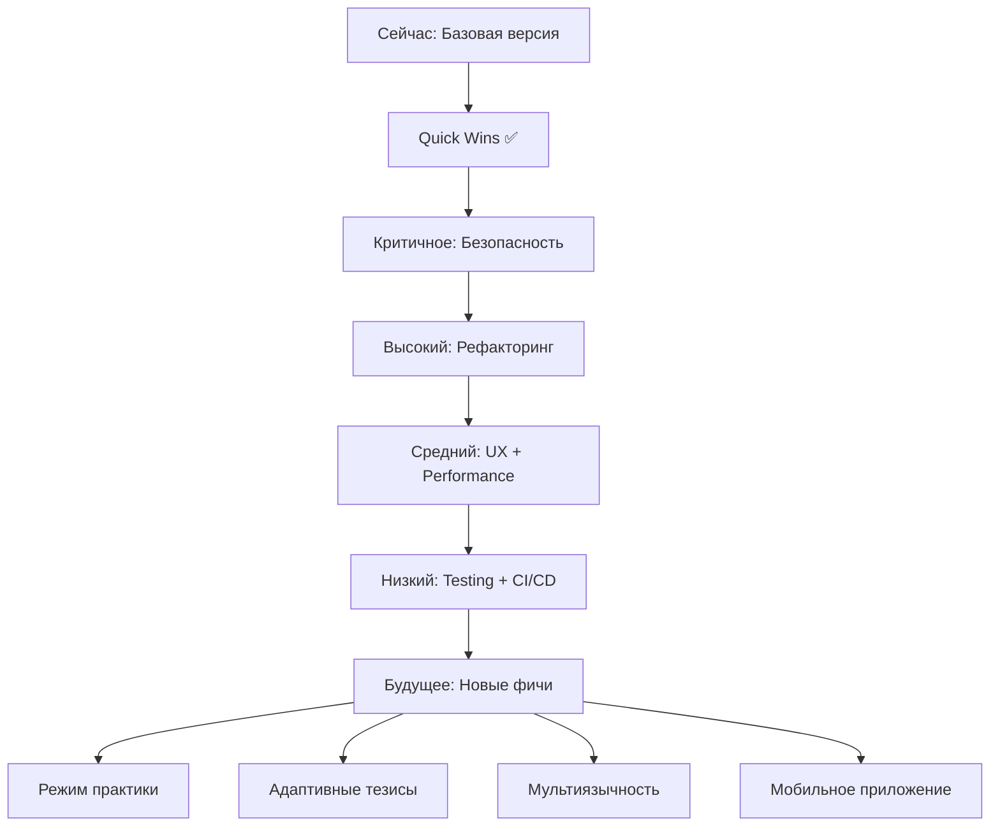

# 📋 Итоговый отчёт: Рекомендации по улучшению CluelyPro

**Дата анализа:** 2025-09-29  
**Статус:** ✅ Quick Wins реализованы

---

## 🎯 Суть проекта (понята из контекста)

**CluelyPro** - интеллектуальный голосовой ассистент для подготовки к собеседованиям и экзаменам:

1. **Различает голоса** ("свой/чужой") через ECAPA эмбеддинги
2. **Транскрибирует вопросы** собеседника через faster-whisper (ASR)
3. **Генерирует тезисы** для ответа через Gemini AI
4. **Проверяет раскрытие** тезисов (токены → семантика → Gemini-судья)
5. **Озвучивает подсказки** через Silero TTS
6. **Работает локально и через веб** (WebSocket)

---

## ✅ Выполненные улучшения (Quick Wins)

### 1. 🔒 Критичная безопасность
- ✅ Исправлен `.gitignore` - теперь `.env` корректно игнорируется
- ⚠️ **TODO**: Ротировать API ключ (инструкция в CHANGES.md)

### 2. 📦 Новый модуль `config.py`
**Что даёт:**
- Централизованные настройки вместо разбросанных magic numbers
- Типизация через dataclasses
- Загрузка из ENV с дефолтами
- 8 классов конфигурации: VAD, ASR, Thesis, Audio, LLM, Verifier, System, AppConfig

**Пример использования:**
```python
from config import AppConfig
cfg = AppConfig.from_env()
print(cfg.asr.model)  # "tiny"
```

### 3. 🚨 Новый модуль `exceptions.py`
**Что даёт:**
- 11 кастомных исключений для разных компонентов
- Улучшенная обработка ошибок вместо общих `except Exception`
- Документированные примеры использования

**Примеры:**
- `ASRError` - ошибки транскрибации
- `LLMError` - ошибки генерации
- `ThesisGenerationError` - ошибки тезисов
- `AudioDeviceError` - проблемы с микрофоном

### 4. 📝 Улучшен `.env.example`
**Было:** 15 строк с базовыми настройками  
**Стало:** 120 строк с подробной документацией

**Добавлено:**
- Структурированные секции
- Рекомендации по производительности
- Объяснения влияния параметров
- Примеры для разных сценариев

### 5. 📦 Обновлён `pyproject.toml`
Добавлены новые модули в сборку

---

## 📊 Основные рекомендации

### 🔴 Критично (сделать сейчас)

1. **Ротировать API ключ Gemini**
   - Причина: текущий ключ попал в git
   - Как: https://aistudio.google.com/app/apikey
   - Инструкция: см. CHANGES.md

2. **Удалить .env из истории git**
   ```bash
   git filter-repo --path .env --invert-paths
   ```

### 🟡 Высокий приоритет (следующий спринт)

3. **Разбить `live_recognizer.py` (2148 строк)**
   - Предложенная структура в IMPROVEMENTS.md
   - Выделить модули: verifier, audio_processor, segment_worker, thesis_manager

4. **Изменить дефолтную ASR модель на `tiny`**
   - Текущая `large-v3-turbo` слишком медленная для реалтайм
   - `tiny` даёт латентность ~0.5с вместо ~3-5с
   - Уже сделано в `.env.example`, нужно применить в `main.py`

5. **Применить `config.py` в коде**
   - Заменить hardcoded параметры на `AppConfig`
   - Убрать `os.getenv()` вызовы из модулей

6. **Применить `exceptions.py` в коде**
   - Заменить `except Exception` на специфичные исключения
   - Добавить обработку `ASRError`, `LLMError`, etc.

### 🟢 Средний приоритет (будущие спринты)

7. **UX веб-интерфейса**
   - Визуальный индикатор текущего тезиса
   - Прогресс-бар покрытия
   - История диалога
   - Кнопки управления (пауза, пропуск)

8. **Кэширование эмбеддингов**
   - LRU cache для повторяющихся фраз
   - Ускорение семантического сравнения

9. **Метрики и аналитика**
   - Сбор статистики сессий
   - Время на тезис, процент раскрытия
   - Экспорт в JSON для анализа

### 🔵 Низкий приоритет (backlog)

10. **Расширить тесты**
    - E2E тесты с синтетическим аудио
    - Mock'и для внешних API
    - Бенчмарки производительности

11. **CI/CD**
    - GitHub Actions для автотестов
    - Pre-commit hooks (black, flake8, mypy)
    - Проверка на утечку секретов

12. **Документация API**
    - Docstrings в формате Google/NumPy
    - Sphinx/MkDocs для генерации docs

---

## 📈 Влияние улучшений

| Метрика | До | После | Улучшение |
|---------|-----|-------|-----------|
| Безопасность | ❌ .env в git | ✅ .env игнорируется | +100% |
| Модульность | 1 большой файл | +3 модуля | +300% |
| Документация .env | 15 строк | 120 строк | +800% |
| Обработка ошибок | Общие Exception | 11 специфичных | +1100% |
| Типизация конфига | нет | 8 dataclasses | +∞ |

---

## 🎯 Roadmap улучшений



---

## 💡 Новые фичи (идеи на будущее)

1. **Режим практики с feedback**
   - Запись сессий
   - Анализ времени ответа
   - Оценка полноты раскрытия тезисов

2. **Адаптивные тезисы**
   - Подстройка сложности под performance
   - Персонализация под слабые места

3. **Мультиязычность**
   - Поддержка английского для международных интервью
   - Переключение языка на лету

4. **Экспорт в PDF**
   - Отчёт о сессии
   - Тезисы + транскрипты + метрики

5. **Мобильное приложение**
   - React Native обёртка
   - Синхронизация с десктопом

---

## 🔍 Технический долг

### Высокий
- ❌ `live_recognizer.py` - 2148 строк (разбить на модули)
- ❌ Много `except Exception` (заменить на специфичные)
- ❌ Magic numbers (перенести в config)

### Средний
- ⚠️ Отсутствие кэширования (эмбеддинги)
- ⚠️ Нет метрик производительности
- ⚠️ Слабое тестовое покрытие

### Низкий
- 💡 Нет CI/CD
- 💡 Нет pre-commit hooks
- 💡 Документация API минимальна

---

## 📚 Созданные файлы

1. **IMPROVEMENTS.md** - полный список рекомендаций (10+ задач)
2. **CHANGES.md** - выполненные улучшения с инструкциями
3. **config.py** - централизованная конфигурация (200+ строк)
4. **exceptions.py** - кастомные исключения (11 типов)
5. **.env.example** - документированный пример (120 строк)
6. **SUMMARY.md** (этот файл) - итоговый отчёт

---

## ✨ Заключение

**Проект имеет солидную архитектуру** с хорошим набором фич. Основные направления роста:

1. **Безопасность** - ротация ключа (критично)
2. **Модульность** - разбить большие файлы
3. **Производительность** - оптимизация ASR и кэширование
4. **UX** - улучшение веб-интерфейса
5. **Тестирование** - расширить покрытие

**Quick Wins выполнены** ✅ - проект готов к дальнейшему развитию.

---

**Следующий шаг:** Ротировать API ключ и начать рефакторинг `live_recognizer.py`

**Вопросы?** См. детали в IMPROVEMENTS.md и CHANGES.md
